# Satellite Demo - Food Delivery

Food Delivery is a cloud native microservices based application leveraging multiple common cloud native opensource projects to develop a simulated version of an UberEats/GrubHub type business. The application uses OpenShift, Kafka, Redis, and MongoDB as its base set of middleware and adds set of domain specific middleware and an API front end. In this version, as seen in the architecture diagram, the MongoDB instance has been extracted out, and is consumed via a managed service. This lab assumes the MongoDB is already deployed in an IBM Cloud Account.

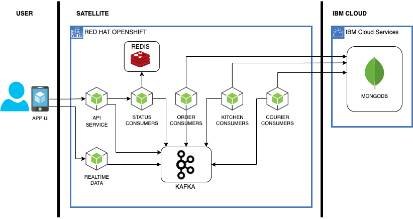

## History and Reference

This set of assets is based on the material used at the Digital Developer Conference: Hybrid Cloud Labs and the IBM Cloud Community Days Conference. You can reference details on the workshops here: https://anthonyamanse.gitbook.io/ibm-satellite-workshop/

The base application itself was developed by Yan Koyfam and Anthony Amaranse and published here: https://github.com/IBM/scaling-apps-with-kafka. It was later modified to remove the dependance on Confluent.

### Demo Walkthrough

You can see a walkthrough of the Satellite Config demo utilizing the Food Delivery app here: 

[Demo Walkthrough](https://ibm.box.com/s/gmp2tr21r9xszbg3t592fg8ypg43879o)

## Setup

The main demo script assumes you have a Satellite Location set up with a ROKS cluster.

Create a new project in your cluster (ie: delivery), which will be used as your namespace for the project.

`oc new-project <project_name>`

The _deployments_ and _route-*_ folders contain the YAML files used to deploy the application. You need to edit and change the `{{YOUR_NAMESPACE}}` and `{{CLUSTER_DOMAIN_NAME}}` tokens to use the namespace and cluster URL for your demo system. For this lab, for the routes, we will only use the `route-dev/routes.yaml` file.

This can be done manually (there are only a few files), you can use `Find and Replace` to find every instance of `{{YOUR_NAMESPACE}}` and `{{CLUSTER_DOMAIN_NAME}}` and replace them in the project directory or use something like mustache to preprocess the YAML files and make the substitutions. If you are using mustache or something similar the file `config.yaml` is used as a configuration file.

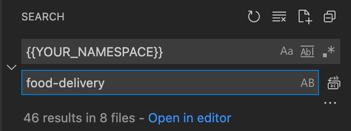

Additionally in the _deployments_ folder, you will need to edit secrets and configmaps. Create a `icd-secrets.yaml` file from the `icd-secrets.yaml.template` file and replace the placeholders `{{MONGO_HOSTNAME}}`, `{{MONGO_PORT}}`, `{{MONGO_USERNAME}}` and `{{MONGO_PASSWORD}}`. Also add your initials or a random character string to the DBNAME variable as well, replacing the `{{INITIALS}}` placeholder.

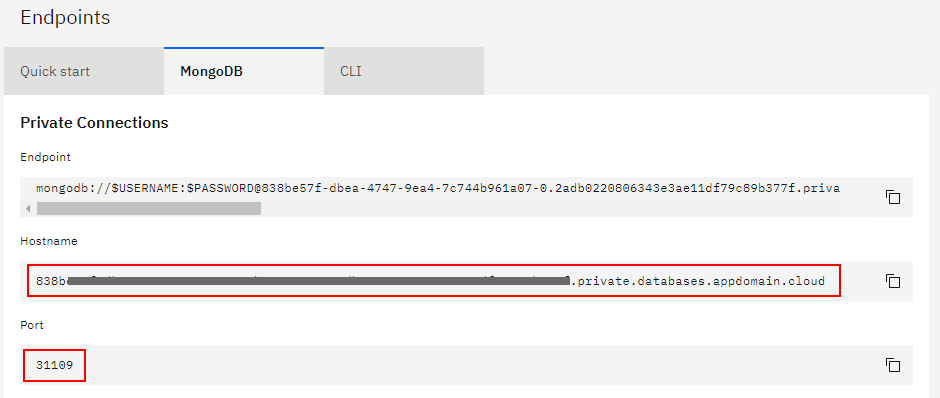

Create a `icd-cert.yaml` file from the `icd-cert.yaml.template` file and populate the placeholder {{CERTIFICATE}} with the contents from your MongoDB instance.

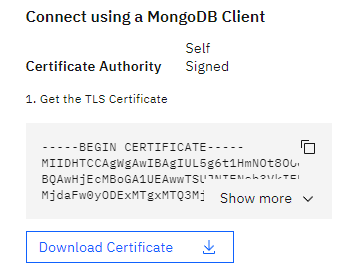

Apply the configmaps and secrets to your project.

`oc create -f icd-cert.yaml`

`oc create -f icd-secrets.yaml`

#### Note: Private only MongoDB ####
If you are using a Private MongoDB instance, you will need to also create a Satellite Link entry to connect. You will also need to utilize a Envoy sidecar in the deployment to reference the Satellite Link endpoint, but keeping the original MongoDB hostname for the handshake. In the instructions later, you will need to use the `backend-envoy.yaml` deployment version in place of the `backend.yaml` file.

If you plan to use a Public Endpoint for your ICD Mongo instance, you can skip down to the `Create Satellite Cluster Group` step.

Create a Satellite Link entry with your MongoDB instance private endpoint and port details. From your locations detail page, select `Link Endpoints` and then click 'Create an endpoint`. 

Select Cloud for the destination resource and click Next.

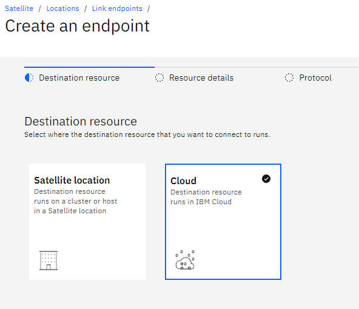

Enter a name for your Endpoint, enter the FQDN of the private MongoDB instance, enter the port and click Next.

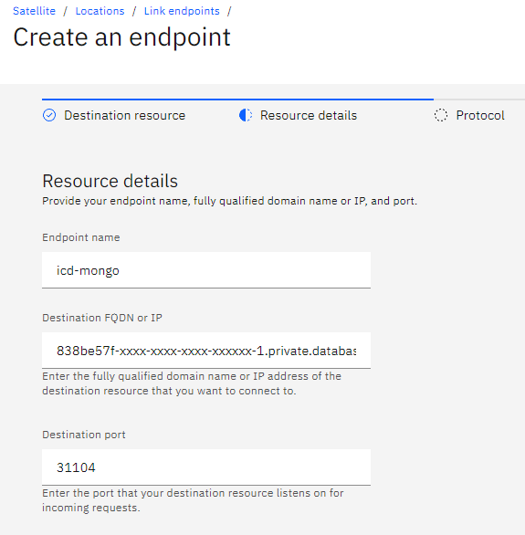

Select TCP for the Source protocol.

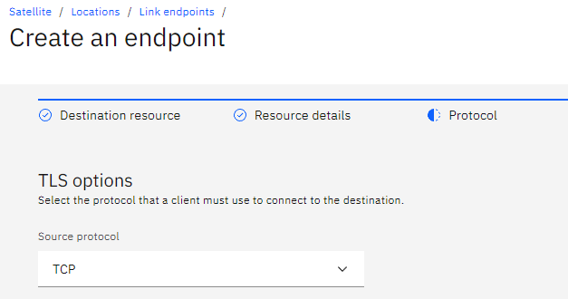

Once the new endpoint has been created, copy the new Satellite Link Endpoint and Port.

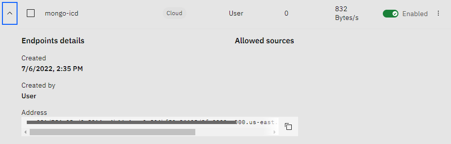

You will need to create a configmap for the Envoy container using the `mongo-proxy-config.yaml` file. Populate the placeholders for the `{{MONGO_PRIVATE_HOST}}` and `{{MONGO_PRIVATE_PORT}}` with your original MongoDB Private details. Populate the `{{MONGO_SATELLITE_HOST}}` and `{{MONGO_SATELLITE_PORT}}` placeholders with the new Satellite Link details you created.

`oc create -f mongo-proxy-config.yaml`

#### Create Satellite Cluster Group

- Create a Cloud Satellite cluster group. Add the appropriate cluster to the cluster group.

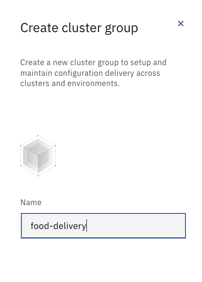

- Create a Cloud Satellite configuration.

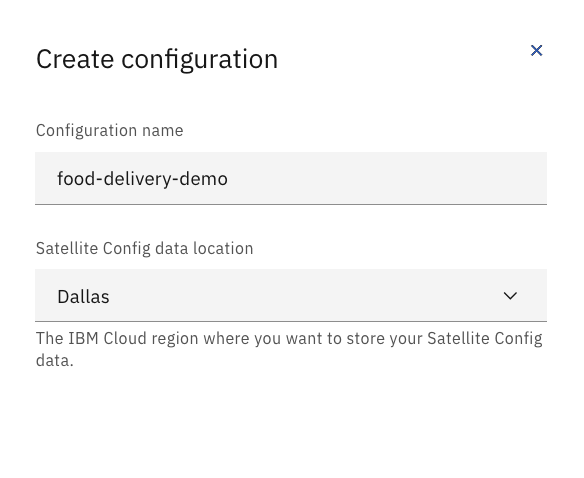

Open the configuration and create a new version using the `kafka-redis.yaml` file and name it something recognizable such as `kafka-redis`, repeat this creation of versions for `backend.yaml`, `frontend.yaml`, `frontend-v2.yaml` files in the deployment folder and name the versions appropriately. Remember to use the `backend-envoy.yaml` instead of `backend.yaml` if you are using Satellite Link for your MongoDB instance connection.

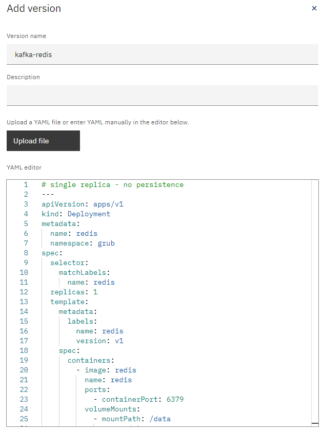

- Open the Cloud Satellite configuration for this project and create a version for the `routes.yaml` file found in the `route-dev` folder.

- Create a Cloud Satellite subscription for the route labeled with the route's name. choose the associated version and add to the appropriate cluster group(s).

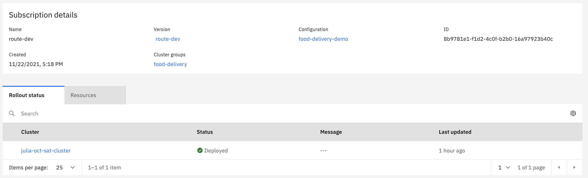

- Create a Cloud Satellite subscription labeled `kafka-redis`, choose the version  `kafka-redis` and add the cluster group(s).

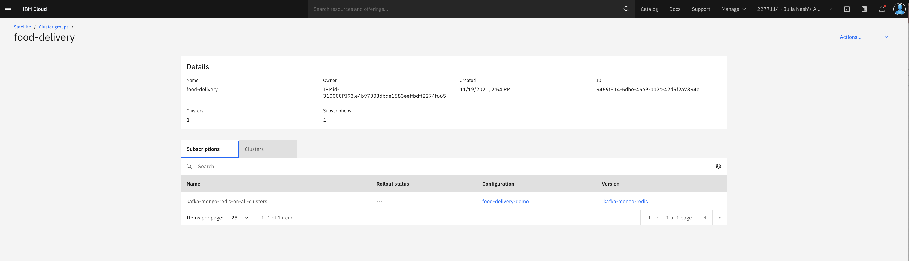

- Check `Pods` within the cluster(s) to see if the services are running.

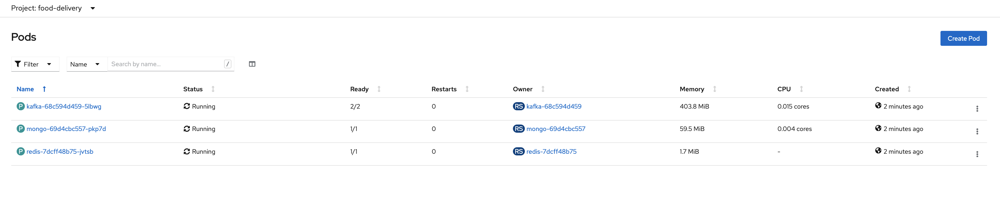

- Create a Cloud Satellite subscription labeled `backend-microservices`, choose the version `backend` and add the cluster group(s).

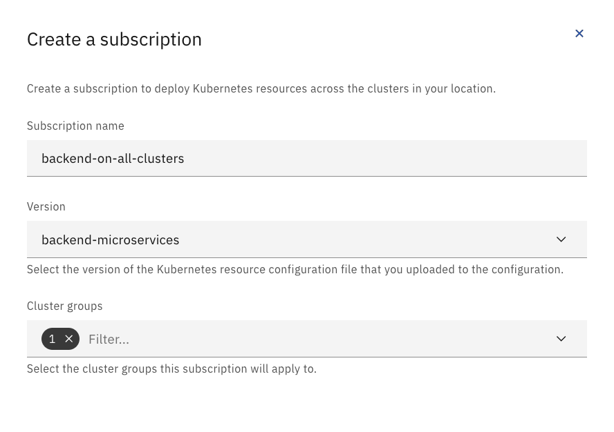

- Check `Pods` within the cluster(s) to see if the services are running.
- Create a Cloud Satellite subscription labeled `frontend`, choose the version `frontend-v1` or the name you provided for the first frontend yaml file and add the cluster group.
- Check `Pods` within the cluster(s) to see if the services are running.
- Go to `Routes` in your cluster(s) and find the `example-food` route. Open the URL.

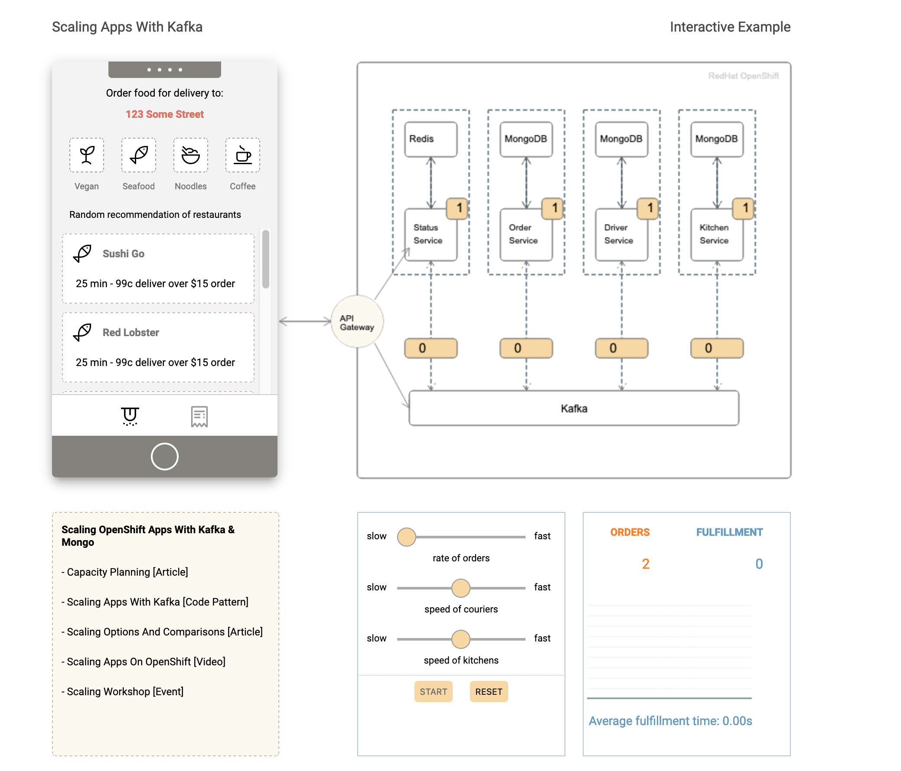

- Now we will show updates to the application by switching from a frontend light theme (`frontend-v1`) to a dark theme (`frontend-v2`).
- If the `frontend-v2` version is already created in your project's configuration, then skip this step. Open the project's Cloud Satellite Configuration and select `Versions` from the sidenav bar. Find the `frontend-v1` version and open the ellipsis to select `Duplicate`. Change the title to `frontend-v2` and the `- image: mcltn/example-food-frontend:1.0` to `- image: mcltn/example-food-frontend:2.0`. Press `Add`.
- Go into the Cloud Satellite subscriptions. Update the `frontend` subscription to the `frontend-v2` version and press `Save`. 

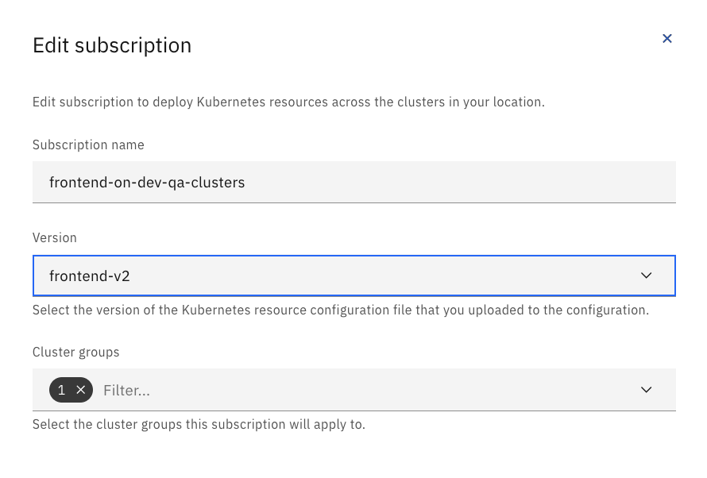

- Look at `Pods` to see a new `example-food` deployment configured (frontend-v2) and another deployment (frontend-v1) terminating. 

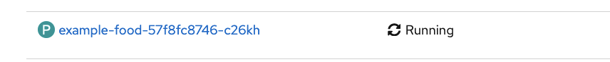

- Once the `frontend-v1` deployment terminates, open the `example-food` application route again and view the application to see the update to the dark theme that `frontend-v2` configured. 

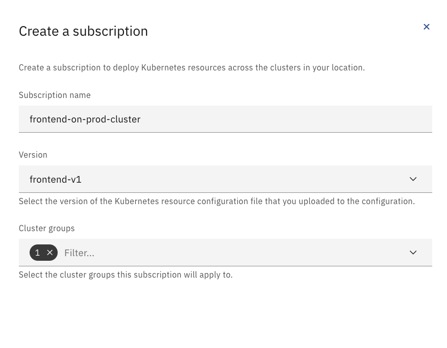

- Press `Start` on the management controls panel in the `example-food` GUI to increase the `Order` quantity.
- Adjust the controls to have a higher rate of food orders, increase the speed of the couriers and kitchens.

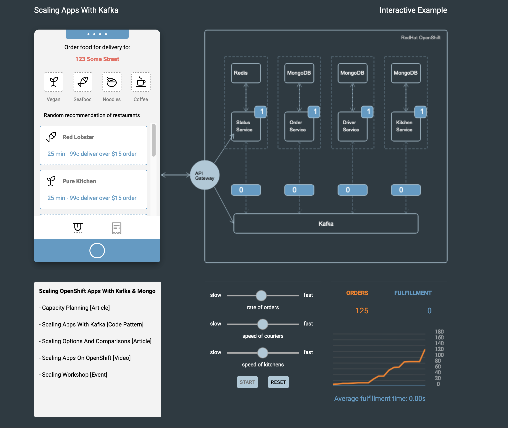

This demonstration shows the near-to instant update of an application via Cloud Satellite Config.